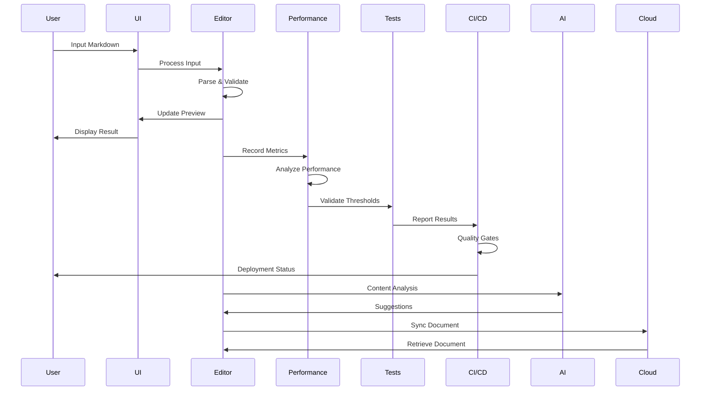

# MD Reader Pro - System Architecture

## 🏗️ Complete System Architecture

This document provides a comprehensive overview of the MD Reader Pro application architecture, including current implemented systems and planned future enhancements.

## 🎯 Architecture Overview

```mermaid
graph TB
    %% Current Core Systems (Solid Lines)
    subgraph "Frontend Application"
        UI[User Interface Layer]
        EDITOR[Markdown Editor Core]
        PREVIEW[Real-time Preview]
        HELP[Help System]
        FILES[File Operations]
    end

    subgraph "Testing & Quality Infrastructure"
        TESTS[Test Suite<br/>132 Tests]
        PERF[Performance Testing]
        BENCH[Benchmark Analysis]
        COV[Coverage Reporting]
        LINT[Code Quality]
    end

    subgraph "Build & Development"
        WEBPACK[Webpack 5 Build]
        BABEL[Babel Transpiler]
        DEV[Dev Server + HMR]
        PROD[Production Build]
    end

    subgraph "Performance Monitoring"
        MONITOR[Performance Monitor]
        REGRESSION[Regression Detection]
        METRICS[Real-time Metrics]
        BASELINE[Performance Baselines]
    end

    subgraph "CI/CD Pipeline"
        GHA[GitHub Actions]
        AUTO_TEST[Automated Testing]
        DEPLOY[Deployment Pipeline]
        QUALITY[Quality Gates]
    end

    %% Future Systems (Dashed Lines - Not Implemented)
    subgraph "Future: Advanced Features"
        SYNTAX[Syntax Highlighting]:::future
        EXPORT[HTML/PDF Export]:::future
        THEMES[Theme System]:::future
        SEARCH[Advanced Search]:::future
        STATS[Live Statistics]:::future
    end

    subgraph "Future: Collaboration Platform"
        REALTIME[Real-time Collaboration]:::future
        SHARING[Document Sharing]:::future
        COMMENTS[Collaborative Comments]:::future
        VERSION[Version Control]:::future
    end

    subgraph "Future: Cloud Infrastructure"
        CLOUD[Cloud Sync Service]:::future
        AUTH[Authentication System]:::future
        DATABASE[(Document Database)]:::future
        CDN[Content Delivery Network]:::future
        API[REST API Gateway]:::future
    end

    subgraph "Future: AI & Analytics"
        AI[AI Writing Assistant]:::future
        ANALYTICS[Writing Analytics]:::future
        INSIGHTS[Productivity Insights]:::future
        SUGGESTIONS[Smart Suggestions]:::future
    end

    subgraph "Future: Multi-Platform"
        MOBILE[Mobile Apps]:::future
        DESKTOP[Desktop App]:::future
        PWA[Progressive Web App]:::future
        EXTENSIONS[Browser Extensions]:::future
    end

    subgraph "Future: Enterprise Features"
        SSO[Single Sign-On]:::future
        ADMIN[Admin Dashboard]:::future
        TEAMS[Team Management]:::future
        AUDIT[Audit Logging]:::future
        COMPLIANCE[Compliance Tools]:::future
    end

    %% Current System Connections (Solid)
    UI --> EDITOR
    UI --> PREVIEW
    UI --> HELP
    UI --> FILES

    EDITOR --> TESTS
    PREVIEW --> TESTS
    FILES --> TESTS
    HELP --> TESTS

    TESTS --> PERF
    PERF --> BENCH
    BENCH --> COV
    COV --> LINT

    WEBPACK --> DEV
    WEBPACK --> PROD
    BABEL --> WEBPACK

    PERF --> MONITOR
    MONITOR --> REGRESSION
    REGRESSION --> METRICS
    METRICS --> BASELINE

    GHA --> AUTO_TEST
    AUTO_TEST --> QUALITY
    QUALITY --> DEPLOY

    %% Future System Connections (Dashed)
    EDITOR -.-> SYNTAX
    EDITOR -.-> EXPORT
    UI -.-> THEMES
    UI -.-> SEARCH
    EDITOR -.-> STATS

    EDITOR -.-> REALTIME
    REALTIME -.-> SHARING
    SHARING -.-> COMMENTS
    COMMENTS -.-> VERSION

    REALTIME -.-> CLOUD
    CLOUD -.-> AUTH
    CLOUD -.-> DATABASE
    CLOUD -.-> CDN
    API -.-> DATABASE

    EDITOR -.-> AI
    AI -.-> ANALYTICS
    ANALYTICS -.-> INSIGHTS
    INSIGHTS -.-> SUGGESTIONS

    UI -.-> MOBILE
    UI -.-> DESKTOP
    UI -.-> PWA
    PWA -.-> EXTENSIONS

    AUTH -.-> SSO
    SSO -.-> ADMIN
    ADMIN -.-> TEAMS
    TEAMS -.-> AUDIT
    AUDIT -.-> COMPLIANCE

    %% Styling
    classDef future fill:#f9f9f9,stroke:#999,stroke-dasharray: 5 5,color:#666
    classDef current fill:#e1f5fe,stroke:#01579b,stroke-width:2px
    classDef critical fill:#ffebee,stroke:#c62828,stroke-width:2px

    class UI,EDITOR,PREVIEW,HELP,FILES current
    class TESTS,PERF,BENCH,COV,LINT critical
    class WEBPACK,BABEL,DEV,PROD current
    class MONITOR,REGRESSION,METRICS,BASELINE critical
    class GHA,AUTO_TEST,DEPLOY,QUALITY current
```

## 📊 System Components Detail

### Current Implementation (v3.0.0)

#### Core Application Layer
- **User Interface** - Professional split-pane design with responsive layout
- **Markdown Editor** - Real-time editing with syntax support and shortcuts
- **Live Preview** - Instant markdown rendering using Marked.js
- **Help System** - Interactive markdown reference and examples
- **File Operations** - Drag & drop, upload, save with error handling

#### Testing & Quality Infrastructure
- **Test Suite** - 132 comprehensive tests across 9 categories
- **Performance Testing** - Real-time monitoring with statistical analysis
- **Benchmark Analysis** - P95/P99 percentile performance validation
- **Coverage Reporting** - 88.23% function coverage with detailed metrics
- **Code Quality** - ESLint with modern flat configuration

#### Development & Build
- **Webpack 5** - Modern bundling with HMR and optimization
- **Babel Transpiler** - ES6+ to ES5 transpilation for compatibility
- **Development Server** - Live reloading with error overlay
- **Production Build** - Optimized bundles with tree shaking

#### Performance Monitoring
- **Performance Monitor** - Real-time metrics collection and analysis
- **Regression Detection** - Automated performance degradation alerts
- **Metrics Dashboard** - Live performance visualization
- **Baseline Management** - Performance target maintenance

#### CI/CD Pipeline
- **GitHub Actions** - Automated testing and deployment
- **Quality Gates** - Automated quality assurance checks
- **Deployment Pipeline** - Production deployment automation

### Future Roadmap Implementation

#### Phase 1: Advanced Features (v3.2.0)
- **Syntax Highlighting** - Code block highlighting with Prism.js
- **Export Functionality** - HTML/PDF generation with custom styling
- **Theme System** - Customizable UI themes and color schemes
- **Advanced Search** - Full-text search with regex support
- **Live Statistics** - Real-time word/character/reading time tracking

#### Phase 2: Collaboration Platform (v3.5.0)
- **Real-time Collaboration** - Multi-user editing with conflict resolution
- **Document Sharing** - Secure document sharing with permissions
- **Collaborative Comments** - Inline comments and discussions
- **Version Control** - Git-like versioning for documents

#### Phase 3: Cloud Infrastructure (v4.0.0)
- **Cloud Sync Service** - Cross-device document synchronization
- **Authentication System** - Secure user authentication and authorization
- **Document Database** - Scalable document storage and retrieval
- **API Gateway** - RESTful API for third-party integrations
- **Content Delivery Network** - Global content distribution

#### Phase 4: AI & Analytics (v4.2.0)
- **AI Writing Assistant** - Smart writing suggestions and improvements
- **Writing Analytics** - Detailed writing pattern analysis
- **Productivity Insights** - Personal productivity metrics and trends
- **Smart Suggestions** - Context-aware content recommendations

#### Phase 5: Multi-Platform (v4.5.0)
- **Mobile Applications** - Native iOS and Android apps
- **Desktop Application** - Electron-based cross-platform desktop app
- **Progressive Web App** - Offline-capable web application
- **Browser Extensions** - Integration with popular browsers

#### Phase 6: Enterprise Features (v5.0.0)
- **Single Sign-On** - Enterprise authentication integration
- **Admin Dashboard** - Centralized administration interface
- **Team Management** - Organization and team collaboration tools
- **Audit Logging** - Comprehensive activity tracking
- **Compliance Tools** - GDPR, HIPAA, and other compliance features

## 🔄 Data Flow Architecture

## 🎛️ Configuration Architecture

### Current Configuration Files
- `webpack.config.cjs` - Build configuration and development server
- `jest.config.cjs` - Testing framework configuration with performance settings
- `eslint.config.js` - Code quality rules and linting configuration
- `babel.config.cjs` - JavaScript transpilation settings
- `package.json` - Dependencies, scripts, and project metadata

### Future Configuration
- **Environment Configuration** - Multi-environment deployment settings
- **Feature Flags** - Dynamic feature enablement/disablement
- **Performance Budgets** - Automated performance constraint enforcement
- **Security Policies** - Content Security Policy and security headers
- **Monitoring Configuration** - APM and logging service integration

## 📈 Scalability Considerations

### Current Scalability Features
- **Modular Architecture** - Component-based design for easy extension
- **Performance Monitoring** - Proactive performance issue detection
- **Test Automation** - Comprehensive automated quality assurance
- **Build Optimization** - Efficient bundling and asset management

### Future Scalability Plans
- **Microservices Architecture** - Service-oriented backend design
- **Horizontal Scaling** - Multi-instance deployment capability
- **Caching Strategy** - Multi-layer caching for performance
- **Load Balancing** - Traffic distribution across instances
- **Database Sharding** - Distributed data storage strategy

## 🔐 Security Architecture

### Current Security Measures
- **Input Validation** - Markdown input sanitization and validation
- **File Upload Security** - File type and size validation
- **Error Handling** - Secure error reporting without information leakage
- **Dependency Security** - Regular dependency vulnerability scanning

### Future Security Enhancements
- **Authentication & Authorization** - Secure user management system
- **Data Encryption** - End-to-end encryption for sensitive data
- **API Security** - OAuth 2.0 and rate limiting for APIs
- **Audit Trails** - Comprehensive security event logging
- **Penetration Testing** - Regular security vulnerability assessments

---

*This architecture documentation is updated regularly to reflect the current state and future plans of the MD Reader Pro application.*