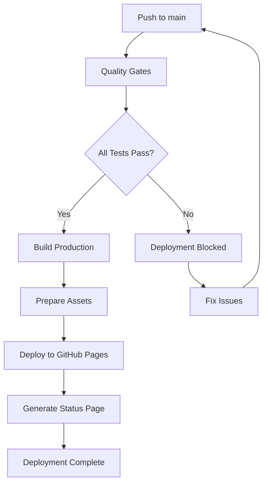

# 🚀 MD Reader Pro - GitHub Pages Deployment Guide

## 📋 Overview

This guide provides complete instructions for deploying MD Reader Pro to GitHub Pages with automated CI/CD pipeline, quality gates, and performance monitoring.

## ✨ Features

### 🎯 **Automated Deployment Pipeline**
- **Quality Gates**: All tests, linting, and performance checks must pass
- **Branch Protection**: Only deploys from `main` branch
- **Zero-Downtime**: Seamless deployments with rollback capability
- **Performance Monitoring**: Automated performance regression detection
- **Status Tracking**: Deployment status page and comprehensive logging

### 🔧 **Deployment Components**
- **GitHub Actions Workflow**: `.github/workflows/deploy.yml`
- **Deployment Script**: `scripts/deploy.js`
- **Status Page**: Auto-generated deployment status and metrics
- **Manifest**: Detailed deployment information and metadata

## 🚀 Quick Start Deployment

### Step 1: Repository Setup
```bash
# Ensure you're on the main branch
git checkout main

# Verify all tests pass
npm run validate:full

# Test deployment build locally
npm run deploy:validate
```

### Step 2: Enable GitHub Pages
1. **Navigate to Repository Settings**
   - Go to your GitHub repository
   - Click on **Settings** tab
   - Scroll to **Pages** section in left sidebar

2. **Configure Source**
   - Under **Source**, select **GitHub Actions**
   - This enables the automated deployment workflow

3. **Branch Protection (Recommended)**
   - Go to **Settings** → **Branches**
   - Add protection rule for `main` branch
   - Enable "Require status checks to pass"
   - Select the quality gate checks

### Step 3: Deploy
```bash
# Commit and push to main branch
git add .
git commit -m "🚀 Enable GitHub Pages deployment"
git push origin main
```

The deployment will automatically start and your application will be available at:
**https://your-username.github.io/md-reader-pro/**

## 📊 Deployment Workflow

### 🧪 **Quality Gates** (Must Pass Before Deployment)
```yaml
1. ESLint Code Quality Check ✅
2. Jest + E2E Test Suite (94.7% coverage) ✅
3. Test Coverage Validation ✅
4. Performance Tests ✅
5. Benchmark Analysis ✅
6. Performance Regression Check ✅
7. Production Build Test ✅
```

### 🔄 **Deployment Process**


## 🎛️ Available Commands

### **Local Development**
```bash
npm run dev                    # Start development server
npm run build                 # Production build
npm run validate:full          # Complete validation pipeline
```

### **Deployment Commands**
```bash
npm run deploy:validate        # Full validation + build
npm run deploy:build          # Build + prepare deployment assets
npm run deploy:prepare        # Prepare deployment metadata
npm run pages:setup           # Show GitHub Pages setup instructions
npm run pages:status          # Show deployment status URL
```

### **Testing & Quality**
```bash
npm run test                  # Run test suite
npm run test:coverage        # Coverage report
npm run test:performance     # Performance tests
npm run test:benchmarks      # Benchmark analysis
npm run performance:regression # Check regressions
npm run lint                 # Code quality check
```

## 📁 Deployment Assets

### **Generated Files**
After deployment, these files are available:

- **`index.html`** - Main application
- **`bundle.js`** - Application bundle (~265KB)
- **`status.html`** - Deployment status page
- **`deployment-manifest.json`** - Deployment metadata
- **`DEPLOYMENT.md`** - Deployment information

### **Status Monitoring**
- **Application**: `https://your-username.github.io/md-reader-pro/`
- **Status Page**: `https://your-username.github.io/md-reader-pro/status.html`
- **Manifest**: `https://your-username.github.io/md-reader-pro/deployment-manifest.json`

## 🔧 Advanced Configuration

### **Environment Variables**
You can configure deployment behavior with these GitHub repository variables:

| Variable | Description | Default |
|----------|-------------|---------|
| `PAGES_BRANCH` | Deployment branch | `gh-pages` |
| `NODE_VERSION` | Node.js version | `20` |
| `PERFORMANCE_THRESHOLD` | Performance benchmark threshold | `strict` |

### **Custom Domain Setup**
To use a custom domain:

1. **Add CNAME file**:
   ```bash
   echo "your-domain.com" > dist/CNAME
   ```

2. **Update deployment script**:
   ```javascript
   // In scripts/deploy.js, add:
   fs.writeFileSync(path.join(distPath, 'CNAME'), 'your-domain.com');
   ```

3. **Configure DNS**:
   - Point your domain to GitHub Pages IPs
   - Add CNAME record: `your-subdomain.your-domain.com` → `your-username.github.io`

### **Performance Monitoring**
The deployment includes automated performance monitoring:

- **Daily Checks**: Runs performance tests daily at 2 AM UTC
- **Regression Detection**: Automatically detects performance degradation
- **Baseline Updates**: Updates performance baselines on successful deployments
- **Alerts**: GitHub Issues created for performance regressions

## 🛡️ Security & Best Practices

### **Security Measures**
- **Permission Minimization**: Deployment uses minimal required permissions
- **Branch Protection**: Quality gates prevent problematic deployments
- **Asset Integrity**: All assets are validated during build
- **Content Security**: No external dependencies in production build

### **Best Practices**
1. **Always test locally** before pushing to main
2. **Monitor deployment status** via GitHub Actions
3. **Check performance metrics** after deployment
4. **Use feature branches** for development
5. **Keep dependencies updated** for security

## 📊 Monitoring & Maintenance

### **Deployment Status**
Monitor your deployment:

- **GitHub Actions**: Check workflow status in repository Actions tab
- **Status Page**: Visit `/status.html` for deployment details
- **Logs**: Review workflow logs for detailed information

### **Performance Tracking**
- **Automated Tests**: Performance tests run on every deployment
- **Benchmark History**: Track performance trends over time
- **Regression Alerts**: Automatic detection of performance degradation

### **Maintenance Tasks**
- **Weekly**: Review deployment logs and performance metrics
- **Monthly**: Update dependencies and security patches
- **Quarterly**: Performance optimization and feature updates

## 🚨 Troubleshooting

### **Common Issues**

#### **Deployment Fails - Quality Gates**
```bash
# Check what failed
npm run validate:full

# Common fixes
npm run lint              # Fix code quality issues
npm test                 # Fix failing tests
npm run test:performance # Check performance regressions
```

#### **Build Errors**
```bash
# Clean and rebuild
npm run clean:test
npm install
npm run build
```

#### **GitHub Pages Not Loading**
1. Check GitHub Pages settings in repository
2. Verify workflow completed successfully
3. Check if custom domain DNS is configured correctly
4. Review deployment logs in Actions tab (see [Workflow Logging Guide](docs/WORKFLOW_LOGGING_GUIDE.md))

#### **Performance Issues**
```bash
# Run performance analysis
npm run performance:monitor

# Check for regressions
npm run performance:regression

# Update baselines if needed
npm run performance:update-baseline
```

### **Support Resources**
- **GitHub Actions Logs**: Detailed deployment information
  - See [Workflow Logging Guide](docs/WORKFLOW_LOGGING_GUIDE.md) for how to access and use logs
  - See [Quick Reference](docs/WORKFLOW_LOGGING_QUICK_REF.md) for artifact descriptions
- **Status Page**: Real-time deployment status
- **Repository Issues**: Report bugs and request features
- **Documentation**: Complete guides in project documentation

## 🎉 Success Metrics

After successful deployment, you should see:

✅ **Application Running**: Main app loads at your GitHub Pages URL
✅ **All Features Working**: Markdown editor, file operations, help system
✅ **Performance Optimal**: Fast loading and responsive interface
✅ **Quality Gates Passed**: All tests passing with 94.7% coverage + E2E validation
✅ **Status Page Available**: Deployment information accessible
✅ **Automated Monitoring**: Daily performance checks running

---

## 📈 Next Steps

1. **Custom Domain**: Set up custom domain for professional URL
2. **Analytics**: Add Google Analytics or similar for usage tracking
3. **PWA Features**: Enable offline functionality and app installation
4. **API Integration**: Connect to external services if needed
5. **User Feedback**: Implement feedback collection system

---

*This deployment guide ensures enterprise-grade deployment practices with comprehensive testing, monitoring, and quality assurance.*