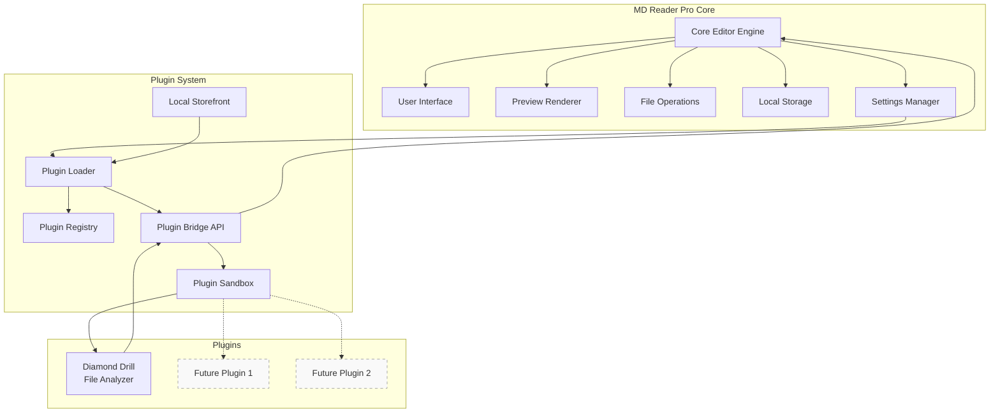
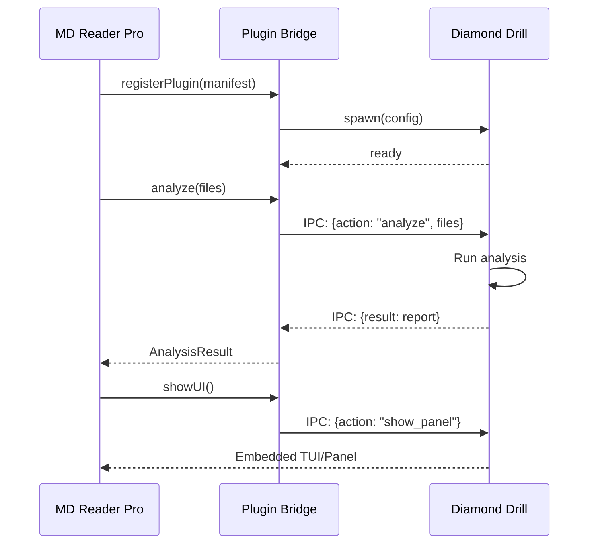

# MD Reader Pro - Plugin Architecture

> **Version**: 4.1.0 (Plugin System Foundation)
> **Status**: Design Document
> **Last Updated**: 2026-02-04

---

## Vision Statement

MD Reader Pro evolves from a standalone markdown editor into an **extensible platform** where the core editor provides a stable foundation and **plugins** add specialized functionality. The first plugin, **Diamond Drill**, demonstrates the architecture by providing file analysis and reporting capabilities.

---

## System Overview



---

## Architecture Layers

### Layer 1: Core Editor (JavaScript)

The existing MD Reader Pro serves as the foundation:

| Component | Responsibility | File |
|-----------|----------------|------|
| **MarkdownEditor** | Main editor class with all functionality | `src/index.js` |
| **AnimationManager** | RAF-based UI animations | `src/utils/AnimationManager.js` |
| **NotificationManager** | Toast notification system | `src/utils/NotificationManager.js` |
| **Preview Renderer** | Markdown to HTML (marked + DOMPurify) | `src/index.js:updatePreview()` |
| **File Operations** | Load, save, drag-drop | `src/index.js:loadFile()` |
| **Settings** | Theme, auto-save, edit mode toggle | `src/index.js:setupSettings()` |

**New Core Capabilities (v4.1.0)**:
- **Edit Mode Toggle**: Settings to disable editing (read-only mode)
- **Plugin Host**: Ability to load and communicate with plugins
- **Event Bus**: Pub/sub for plugin communication

### Layer 2: Plugin System (JavaScript)

```
src/
├── plugins/
│   ├── PluginLoader.js      # Lazy-loads plugins on demand
│   ├── PluginRegistry.js    # Tracks installed/active plugins
│   ├── PluginBridge.js      # API for plugin communication
│   ├── PluginSandbox.js     # Isolation and security
│   └── Storefront.js        # Local plugin management UI
```

#### Plugin Loader

```javascript
// Lazy-load plugins only when activated
class PluginLoader {
    static async load(pluginId) {
        const manifest = await this.fetchManifest(pluginId);

        switch (manifest.type) {
            case 'wasm':      return this.loadWasmPlugin(manifest);
            case 'iframe':    return this.loadIframePlugin(manifest);
            case 'worker':    return this.loadWorkerPlugin(manifest);
            case 'native':    return this.loadNativePlugin(manifest);
        }
    }
}
```

#### Plugin Types

| Type | Technology | Use Case | Isolation |
|------|------------|----------|-----------|
| **WASM** | Rust → WebAssembly | High-performance analysis | Memory sandbox |
| **IFrame** | HTML/JS | UI-heavy plugins | Origin isolation |
| **Worker** | Web Worker | Background processing | Thread isolation |
| **Native** | Rust binary | System-level operations | Process isolation |

### Layer 3: Diamond Drill Plugin (Rust)

Diamond Drill operates as a **native plugin** that provides file analysis:

```
rust-cli/
├── src/
│   ├── main.rs        # CLI entry point + IPC server
│   ├── tui.rs         # Terminal UI (standalone mode)
│   ├── gui.rs         # Native GUI (iced)
│   ├── analyzer.rs    # File analysis engine
│   ├── auth.rs        # Authentication (future: shared with core)
│   ├── config.rs      # Plugin configuration
│   ├── picker.rs      # File picker utilities
│   └── ro_lock.rs     # Read-only enforcement
├── Cargo.toml
└── plugin.manifest.json  # Plugin metadata
```

#### Plugin Manifest (Diamond Drill)

```json
{
    "id": "diamond-drill",
    "name": "Diamond Drill",
    "version": "0.1.0",
    "type": "native",
    "description": "Security-focused file analyzer with read-only enforcement",
    "author": "Diamond Forgemaster",
    "capabilities": [
        "file:analyze",
        "file:report",
        "ui:panel",
        "ui:sidebar"
    ],
    "entry": {
        "native": "diamond",
        "wasm": "diamond_drill.wasm"
    },
    "permissions": [
        "read:files",
        "write:reports"
    ]
}
```

---

## Communication Protocol

### Core ↔ Plugin Bridge



### Message Format

```typescript
interface PluginMessage {
    id: string;           // Unique message ID
    plugin: string;       // Plugin ID
    action: string;       // Action type
    payload: unknown;     // Action-specific data
    timestamp: number;    // Unix timestamp
}

interface PluginResponse {
    id: string;           // Correlates to request
    success: boolean;
    data?: unknown;
    error?: string;
}
```

---

## Local Storefront

The storefront is a local plugin management interface (not a web marketplace):

```
┌─────────────────────────────────────────────────────────────┐
│  MD Reader Pro - Plugin Storefront                    [×]   │
├─────────────────────────────────────────────────────────────┤
│                                                             │
│  ┌─────────────┐  ┌─────────────┐  ┌─────────────┐         │
│  │ Diamond     │  │ Code        │  │ Export      │         │
│  │ Drill       │  │ Highlighter │  │ Suite       │         │
│  │             │  │             │  │             │         │
│  │ ▓▓▓▓▓▓▓▓▓▓ │  │ ░░░░░░░░░░ │  │ ░░░░░░░░░░ │         │
│  │ [ACTIVE]   │  │ [Install]   │  │ [Coming]    │         │
│  └─────────────┘  └─────────────┘  └─────────────┘         │
│                                                             │
│  Installed Plugins (1)                                      │
│  ─────────────────────────────────────────────────────────  │
│  ✓ Diamond Drill v0.1.0      File Analyzer     [Configure] │
│                                                             │
│  Available Plugins (Local)                                  │
│  ─────────────────────────────────────────────────────────  │
│  ○ Code Highlighter          Syntax Highlighting  [Add]     │
│  ○ Export Suite              PDF/HTML Export      [Add]     │
│                                                             │
└─────────────────────────────────────────────────────────────┘
```

### Storefront Features

1. **Plugin Discovery**: Browse locally available plugins
2. **Installation**: Copy plugin to user directory
3. **Configuration**: Per-plugin settings
4. **Activation**: Enable/disable plugins
5. **Updates**: Check for plugin updates (local or remote)

---

## Settings & Edit Mode Toggle

New settings panel for core editor:

```javascript
// Settings structure
const settings = {
    editor: {
        editMode: true,          // Toggle editing on/off
        autoSave: true,
        autoSaveInterval: 60000,
        theme: 'dark'
    },
    plugins: {
        enabled: ['diamond-drill'],
        autoLoad: true,
        sandboxMode: 'strict'
    },
    'diamond-drill': {
        defaultView: 'tui',
        readOnlyEnforce: true,
        reportFormat: 'json'
    }
};
```

### Edit Mode Toggle UI

```
┌─────────────────────────────────────────┐
│  Settings                          [×]  │
├─────────────────────────────────────────┤
│                                         │
│  Editor                                 │
│  ───────────────────────────────────    │
│  [✓] Enable Editing                     │
│      └─ Uncheck to use as viewer only   │
│                                         │
│  [✓] Auto-save                          │
│      └─ Save interval: [60] seconds     │
│                                         │
│  Theme: [Dark ▼]                        │
│                                         │
│  Plugins                                │
│  ───────────────────────────────────    │
│  [✓] Auto-load enabled plugins          │
│  [✓] Sandbox mode (strict)              │
│                                         │
│           [Save]    [Cancel]            │
└─────────────────────────────────────────┘
```

---

## Integration Points

### How Diamond Drill Integrates

1. **File Context Menu**: Right-click file → "Analyze with Diamond Drill"
2. **Sidebar Panel**: Dedicated analysis panel in the UI
3. **Status Bar**: Quick analysis status indicator
4. **Keyboard Shortcut**: `Ctrl+Shift+D` to analyze current file
5. **Batch Reports**: Analyze all open files, generate report

### Plugin UI Slots

```
┌─────────────────────────────────────────────────────────────┐
│  MD Reader Pro                              [≡] [⚙] [×]    │
├─────────────────────────────────────────────────────────────┤
│ [File] [Edit] [View] [Plugins ▼] [Help]                     │
│                        └─ Diamond Drill                     │
│                        └─ Storefront...                     │
├───────────┬─────────────────────────────────┬───────────────┤
│           │                                 │               │
│  SIDEBAR  │       EDITOR / PREVIEW          │   PLUGIN      │
│  SLOT     │                                 │   PANEL       │
│           │                                 │   SLOT        │
│  [Files]  │   # My Document                 │               │
│  [Search] │                                 │  ┌─────────┐  │
│  [Plugin] │   This is markdown content...   │  │ Diamond │  │
│           │                                 │  │ Drill   │  │
│           │                                 │  │ Report  │  │
│           │                                 │  └─────────┘  │
│           │                                 │               │
├───────────┴─────────────────────────────────┴───────────────┤
│  Status: Ready | Words: 42 | [Plugin: Diamond Drill ✓]      │
└─────────────────────────────────────────────────────────────┘
```

---

## Implementation Roadmap

### Phase 1: Foundation (v4.1.0)
- [ ] Add edit mode toggle to settings
- [ ] Create PluginLoader skeleton
- [ ] Create PluginRegistry with manifest parsing
- [ ] Add plugin menu to UI
- [ ] Basic IPC with native plugins (stdout/stdin JSON)

### Phase 2: Diamond Drill Integration (v4.2.0)
- [ ] Create plugin.manifest.json for Diamond Drill
- [ ] Add IPC server mode to Diamond Drill main.rs
- [ ] Implement Plugin Bridge communication
- [ ] Add "Analyze" context menu option
- [ ] Create plugin panel slot in UI

### Phase 3: Storefront (v4.3.0)
- [ ] Create Storefront UI component
- [ ] Local plugin directory scanning
- [ ] Plugin installation/removal
- [ ] Plugin configuration UI
- [ ] Plugin enable/disable

### Phase 4: WASM Support (v4.4.0)
- [ ] Compile Diamond Drill analyzer to WASM
- [ ] WASM plugin loader
- [ ] Memory sandbox implementation
- [ ] Browser-only analysis mode

---

## Security Model

### Plugin Permissions

| Permission | Description | Risk Level |
|------------|-------------|------------|
| `read:files` | Read files selected by user | Low |
| `write:reports` | Write to reports directory | Low |
| `ui:panel` | Display UI panel | Low |
| `ui:sidebar` | Display sidebar content | Low |
| `system:exec` | Execute system commands | **High** |
| `network:fetch` | Make network requests | **Medium** |

### Path Validation & Security (Implemented)

The Diamond Drill plugin implements comprehensive path validation to enforce the security principle: **"File access restricted to user-selected files"**.

#### Security Features

1. **Path Traversal Prevention**
   - Detects and blocks `../` sequences in paths
   - Validates against encoded traversal attempts (`%2e%2e`, etc.)
   - Prevents directory traversal attacks

2. **Allowlist Enforcement**
   - Maintains a list of user-selected directories
   - Only allows file access within approved directories
   - Validates both files and directories against allowlist

3. **Symlink Validation**
   - Resolves symlinks to canonical paths
   - Ensures symlinks don't point outside allowed directories
   - Prevents symlink-based privilege escalation

4. **Runtime Protection**
   - All IPC file operations validate paths before access
   - `analyze`, `browse`, `deep_analyze` actions protected
   - Host can configure allowed directories via `set_allowed_dirs` action

#### Implementation Details

```rust
// Path validator with allowlist enforcement
pub struct PathValidator {
    allowed_dirs: RwLock<HashSet<PathBuf>>,
    enforce_allowlist: bool,
}

// Validation checks:
// 1. Path traversal detection
// 2. Canonicalization (resolves symlinks)
// 3. Symlink target validation
// 4. Allowlist verification
pub fn validate_path<P: AsRef<Path>>(&self, path: P) 
    -> Result<PathBuf, PathValidationError>
```

#### IPC Security Protocol

```javascript
// Host must configure allowed directories before file access
{
    "id": "setup-1",
    "action": "set_allowed_dirs",
    "payload": {
        "directories": ["/home/user/documents", "/home/user/projects"],
        "clear": false
    }
}

// All file operations are validated:
// analyze, deep_analyze, browse, report
{
    "id": "analyze-1",
    "action": "analyze",
    "payload": {
        "files": ["/home/user/documents/file.md"]
        // Path validated against allowlist before access
    }
}
```

### Sandbox Enforcement

```javascript
class PluginSandbox {
    constructor(manifest) {
        this.permissions = new Set(manifest.permissions);
    }

    canRead(path) {
        return this.permissions.has('read:files') &&
               this.isUserSelected(path);
    }

    canWrite(path) {
        return this.permissions.has('write:reports') &&
               this.isReportsDir(path);
    }

    canExecute(cmd) {
        // Native plugins only, with explicit permission
        return this.permissions.has('system:exec') &&
               this.isWhitelisted(cmd);
    }
}
```

---

## File Structure (Complete)

```
md-reader-pro/
├── src/
│   ├── index.html
│   ├── index.js                    # Core editor
│   ├── styles/
│   ├── utils/
│   │   ├── AnimationManager.js
│   │   └── NotificationManager.js
│   └── plugins/                    # NEW: Plugin system
│       ├── PluginLoader.js
│       ├── PluginRegistry.js
│       ├── PluginBridge.js
│       ├── PluginSandbox.js
│       └── Storefront.js
├── rust-cli/                       # Diamond Drill plugin
│   ├── src/
│   │   ├── main.rs
│   │   ├── tui.rs
│   │   ├── gui.rs
│   │   ├── analyzer.rs
│   │   ├── auth.rs
│   │   ├── config.rs
│   │   ├── picker.rs
│   │   └── ro_lock.rs
│   ├── Cargo.toml
│   └── plugin.manifest.json        # NEW: Plugin manifest
├── plugins/                        # NEW: Plugin storage
│   └── diamond-drill/              # Installed plugin
│       ├── plugin.manifest.json
│       └── diamond                  # Binary
├── tests/
├── .github/workflows/
├── ARCHITECTURE.md
├── PLUGIN-ARCHITECTURE.md          # This document
├── README.md
└── package.json
```

---

## Summary

This architecture transforms MD Reader Pro from a single-purpose editor into an **extensible platform**:

1. **Core Editor**: Polished markdown editing with optional read-only mode
2. **Plugin System**: Lazy-loaded modules via local storefront
3. **Diamond Drill**: First plugin demonstrating native integration
4. **Security**: Sandboxed execution with explicit permissions
5. **Flexibility**: Support for WASM, IFrame, Worker, and Native plugins

The design prioritizes:
- **Simplicity**: Local-first, no cloud dependencies
- **Performance**: Lazy loading, native plugins for heavy lifting
- **Security**: Sandboxed plugins with permission model
- **Extensibility**: Clear API for future plugins

---

*This document defines the plugin architecture for MD Reader Pro v4.1.0+*
