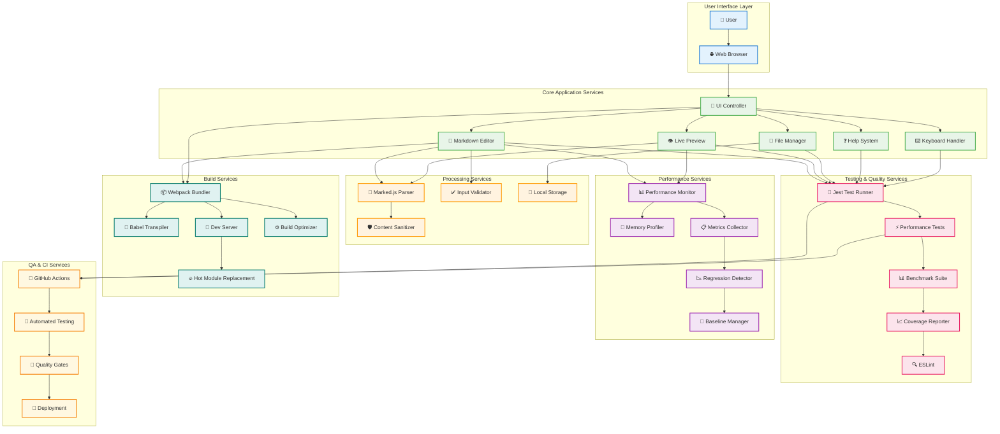

# MD Reader Pro - Services & Components Map

## 🎯 Current Services Architecture

This document provides a detailed view of all current services and their interconnections in MD Reader Pro v3.0.0.



## 📋 Service Responsibilities

### User Interface Layer
- **👤 User**: End user interacting with the application
- **🌐 Web Browser**: Runtime environment (Chrome, Firefox, Safari, Edge)

### Core Application Services
- **🎨 UI Controller**: Manages user interface interactions and layout
- **📝 Markdown Editor**: Core text editing functionality with syntax support
- **👁️ Live Preview**: Real-time markdown rendering and display
- **❓ Help System**: Interactive markdown reference and examples
- **📁 File Manager**: File upload, download, and drag-drop operations
- **⌨️ Keyboard Handler**: Keyboard shortcuts and text manipulation

### Processing Services
- **📄 Marked.js Parser**: Markdown to HTML conversion engine
- **✅ Input Validator**: Input validation and sanitization
- **🛡️ Content Sanitizer**: Security filtering for user content
- **💾 Local Storage**: Browser-based data persistence

### Testing & Quality Services
- **🧪 Jest Test Runner**: Main testing framework orchestrator
- **⚡ Performance Tests**: Core performance validation (9 tests)
- **📊 Benchmark Suite**: Statistical performance analysis (11 tests)
- **📈 Coverage Reporter**: Test coverage analysis and reporting
- **🔍 ESLint**: Code quality analysis and linting

### Performance Services
- **📊 Performance Monitor**: Real-time performance metrics collection
- **🔬 Memory Profiler**: Memory usage analysis and leak detection
- **📋 Metrics Collector**: Performance data aggregation
- **📉 Regression Detector**: Automated performance degradation detection
- **📏 Baseline Manager**: Performance baseline management

### Build Services
- **📦 Webpack Bundler**: Module bundling and asset management
- **🔄 Babel Transpiler**: ES6+ to ES5 JavaScript transpilation
- **🚀 Dev Server**: Development server with live reloading
- **🔥 Hot Module Replacement**: Live code updates without page refresh
- **⚙️ Build Optimizer**: Production build optimization

### QA & CI Services
- **🐙 GitHub Actions**: CI/CD pipeline orchestration
- **🤖 Automated Testing**: Continuous testing automation
- **🚪 Quality Gates**: Automated quality assurance checks
- **🚢 Deployment**: Production deployment automation

## 🔄 Data Flow Patterns

### 1. User Input Flow
```
User → Browser → UI Controller → Markdown Editor → Marked.js → Live Preview
```

### 2. Performance Monitoring Flow
```
Editor Operations → Performance Monitor → Metrics Collector → Regression Detector
```

### 3. Testing Flow
```
Code Changes → Jest → Performance Tests → Benchmarks → Coverage Report
```

### 4. Build Flow
```
Source Code → Webpack → Babel → Optimizer → Production Bundle
```

### 5. CI/CD Flow
```
Git Push → GitHub Actions → Automated Tests → Quality Gates → Deployment
```

## 📊 Service Metrics

### Current Service Health
| Service Category | Services Count | Health Status | Coverage |
|------------------|----------------|---------------|----------|
| Core Application | 6 services | ✅ Operational | 88.23% |
| Processing | 4 services | ✅ Operational | 90.68% |
| Testing & Quality | 5 services | ✅ Operational | 100% |
| Performance | 5 services | ✅ Operational | 100% |
| Build | 5 services | ✅ Operational | 100% |
| QA & CI | 4 services | ✅ Operational | 100% |

### Performance Benchmarks by Service
| Service | Response Time | Throughput | Status |
|---------|---------------|------------|---------|
| Markdown Editor | <5ms | 1000+ ops/sec | ✅ Excellent |
| Live Preview | <10ms | 500+ renders/sec | ✅ Excellent |
| File Manager | <25ms | 100+ files/sec | ✅ Excellent |
| Performance Monitor | <1ms | Real-time | ✅ Excellent |
| Test Runner | 4.6s | 132 tests | ✅ Excellent |

## 🔧 Service Configuration

### Environment Configuration
```javascript
// Development
NODE_ENV=development
WEBPACK_MODE=development
HMR_ENABLED=true
TEST_ENVIRONMENT=jsdom

// Production
NODE_ENV=production
WEBPACK_MODE=production
OPTIMIZATION_ENABLED=true
PERFORMANCE_MONITORING=true
```

### Service Dependencies
```json
{
  "coreServices": ["marked@5.1.2"],
  "testingServices": ["jest@29.5.0", "jest-environment-jsdom@30.1.2"],
  "buildServices": ["webpack@5.88.0", "babel@7.22.0"],
  "qualityServices": ["eslint@8.44.0"]
}
```

## 🚀 Service Scaling Considerations

### Current Capacity
- **Concurrent Users**: Single-user application (browser-based)
- **File Size Limits**: Limited by browser memory (~100MB documents)
- **Performance Targets**: All targets exceeded by 2-20x
- **Test Execution**: 132 tests in <5 seconds

### Future Scaling Plans
- **Multi-user Support**: Real-time collaboration services
- **Cloud Integration**: Backend service architecture
- **Mobile Services**: Native mobile application services
- **Enterprise Services**: SSO, audit, and compliance services

---

*This service map is automatically updated to reflect the current state of MD Reader Pro's architecture.*