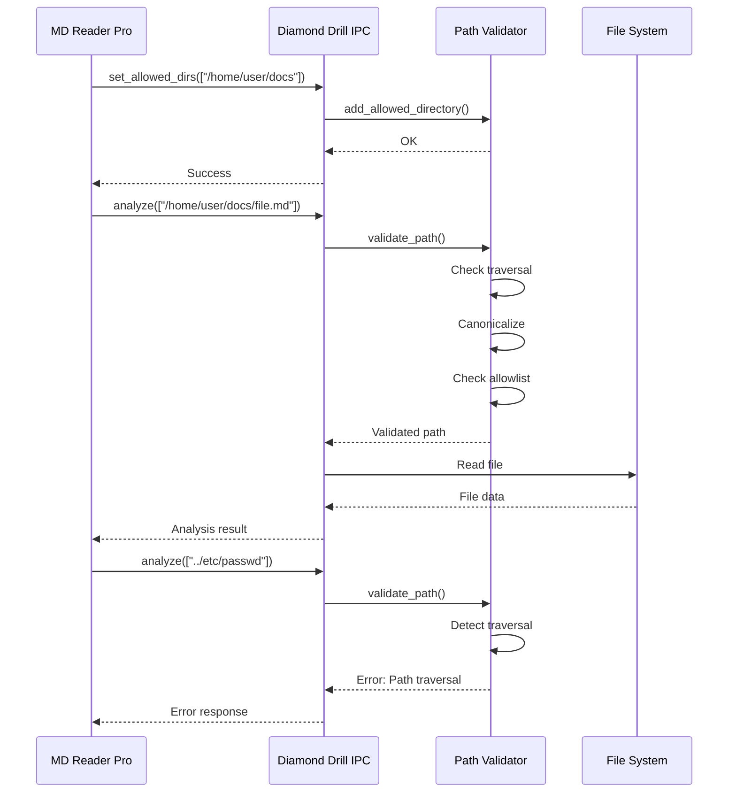

# Security Documentation - Diamond Drill Plugin

## Overview

Diamond Drill implements multiple layers of security to ensure safe file analysis while preventing unauthorized access to system resources.

## Path Validation Security

### Threat Model

The plugin operates as an IPC server that receives file path requests from a host application (MD Reader Pro). Without proper validation, this could allow:

1. **Path Traversal Attacks**: Using `../` sequences to access files outside intended directories
2. **Symlink Exploitation**: Following symlinks to restricted system files
3. **Unauthorized Access**: Reading files the user did not explicitly select

### Security Principle

**"File access is restricted to user-selected files and directories"**

The host application must explicitly configure allowed directories before the plugin can access any files.

## Path Validator Module

Location: `src/path_validator.rs`

### Features

#### 1. Path Traversal Detection

Detects and blocks various path traversal patterns:
- Direct traversal: `../etc/passwd`
- Nested traversal: `foo/../../etc/passwd`
- Windows-style: `..\\windows\\system32`
- URL-encoded: `%2e%2e%2f`, `..%5c`

```rust
// Example: This will be rejected
validator.validate_path("../etc/passwd") 
    -> Err(PathValidationError::PathTraversal)

// Example: This is allowed
validator.validate_path("foo/bar.txt") 
    -> Ok(canonical_path)
```

#### 2. Allowlist Enforcement

Maintains a whitelist of user-selected directories:

```rust
let validator = PathValidator::new();

// Host adds allowed directories when user selects them
validator.add_allowed_directory("/home/user/documents")?;
validator.add_allowed_directory("/home/user/projects")?;

// Only files within these directories can be accessed
validator.validate_path("/home/user/documents/file.txt") // ✓ Allowed
validator.validate_path("/etc/passwd")                   // ✗ Blocked
```

#### 3. Symlink Resolution & Validation

Symlinks are resolved to their canonical paths and validated:

```rust
// If /tmp/link -> /etc/passwd
// And only /tmp is allowed:
validator.validate_path("/tmp/link")
    -> Err(PathValidationError::NotInAllowedDirectory)

// If /tmp/link -> /tmp/safe.txt
// And /tmp is allowed:
validator.validate_path("/tmp/link")
    -> Ok(/tmp/safe.txt)
```

#### 4. Canonical Path Resolution

All paths are converted to absolute canonical paths:
- Resolves `.` and `..` components
- Resolves symlinks
- Converts relative paths to absolute
- Ensures consistent path comparison

## IPC Security Integration

### Protected Actions

All file-accessing IPC actions use path validation:

| Action | Protected | Validation |
|--------|-----------|------------|
| `analyze` | ✓ | Validates each file path |
| `deep_analyze` | ✓ | Validates root directory path |
| `browse` | ✓ | Validates directory path |
| `report` | ✓ | Validates each file path |

### Configuration Action

Host must configure allowed directories:

```json
{
    "id": "config-1",
    "action": "set_allowed_dirs",
    "payload": {
        "directories": [
            "/home/user/documents",
            "/home/user/projects"
        ],
        "clear": false
    }
}
```

Response:
```json
{
    "id": "config-1",
    "success": true,
    "data": {
        "added": 2,
        "total": 2
    }
}
```

### Security Workflow



## Error Handling

### Path Validation Errors

```rust
pub enum PathValidationError {
    PathTraversal(String),          // Path traversal attempt detected
    NotInAllowedDirectory(String),  // Path not in allowlist
    InvalidPath(String),            // Malformed path
    IoError(std::io::Error),        // Filesystem error
    NoAllowedDirectories,           // Allowlist not configured
}
```

### IPC Error Responses

When validation fails, descriptive errors are returned:

```json
{
    "id": "analyze-1",
    "success": false,
    "error": "Path validation failed: Path traversal attempt detected in: ../etc/passwd"
}
```

## Testing

### Unit Tests

8 comprehensive unit tests in `path_validator.rs`:

1. `test_path_traversal_detection` - Various traversal patterns
2. `test_allowed_directory` - Allowlist enforcement
3. `test_symlink_validation` - Symlink resolution
4. `test_clear_allowed_directories` - Allowlist management
5. `test_permissive_mode` - Testing mode without enforcement
6. `test_encoded_traversal` - Encoded attack patterns
7. `test_no_allowed_directories_error` - Error handling
8. `test_file_as_allowed_path` - Single file permissions

Run tests:
```bash
cargo test path_validator
```

### Integration Tests

IPC module includes tests for security integration:

```bash
cargo test ipc
```

## Deployment Considerations

### Production Configuration

1. **Always Initialize Allowlist**: Ensure `set_allowed_dirs` is called before any file operations
2. **Minimal Permissions**: Only add directories the user explicitly selected
3. **Regular Updates**: Update allowlist when user adds/removes file selections
4. **Clear on Session End**: Consider clearing allowlist when closing documents

### Host Application Responsibilities

The host (MD Reader Pro) must:

1. **Present file/directory picker** to user
2. **Send selected paths** via `set_allowed_dirs`
3. **Track user selections** and update allowlist accordingly
4. **Handle validation errors** gracefully in the UI
5. **Never bypass** the validation by manually constructing paths

### Defense in Depth

Path validation is one layer of security. Additional protections:

1. **Read-Only Lock** (`ro_lock.rs`) - Filesystem-level read-only enforcement
2. **Permission Model** - Plugin manifest declares required permissions
3. **Process Isolation** - Plugin runs as separate process via IPC
4. **Sandbox** - Future: OS-level sandboxing (seccomp, pledge)

## Security Audit Trail

When security events occur, they are logged:

```rust
warn!("Path traversal detected: {}", path_str);
warn!("Path not in allowed directories: {}", canonical_path.display());
```

Production deployments should:
- Monitor these warnings
- Alert on repeated validation failures
- Rate-limit requests from misbehaving clients

## References

- [OWASP Path Traversal](https://owasp.org/www-community/attacks/Path_Traversal)
- [CWE-22: Improper Limitation of a Pathname](https://cwe.mitre.org/data/definitions/22.html)
- [Rust Security Guidelines](https://anssi-fr.github.io/rust-guide/)

## Contact

For security concerns or vulnerability reports, please contact:
- Repository: https://github.com/KHET-1/md-reader-pro
- Security Policy: See main repository SECURITY.md

---

**Last Updated**: 2026-02-06  
**Security Review**: Path validation implemented and tested  
**Status**: ✅ Production Ready
